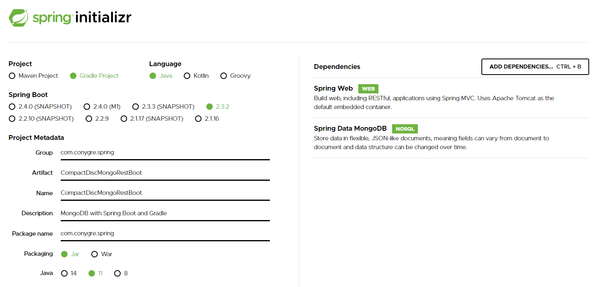
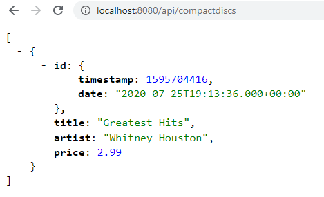

# Implement a REST API using Spring Boot with Spring Data and MongoDB

## Aims

The main focus of this exercise is to implement a REST API. In this exercise you will also see how Spring Boot can be used to handle the configuration and also provide the Tomcat Web server for you. 

You will build a complete end to end application using much of the technology you have covered in the previous chapters, but with much of the code and configuration no longer required.
 
 You will build a complete end to end application using much of the technology you have covered in the previous chapters, but with much of the code and configuration no longer required.

 ## Part 1 Create a Spring Boot Application

1.	Using a Web browser, visit https://start.spring.io/
2.	At the Web page, enter the information as shown below:
 

| Field         	| Value |
| -- | -- |
| Project	        | Gradle Project |
| Language	    | Java |
| Spring Boot	    | 2.3.2 (or later if available) |
| Group	        | com.conygre.spring |
| Artifact	    | CompactDiscMongoRestBoot |
| Name		    | CompactDiscMongoRestBoot |
| Description	    | MongoDB with Spring Boot and Gradle |
| Package name    | com.conygre.spring |
| Packaging	    | jar |
| Java	        | 11 |
| Dependencies	| Spring Web |
|                | Spring Data MongoDB |




3.	Once you have filled in the interface, click **Generate**.
4.	This will download and open a zip file onto your computer.
5.	Extract the zip into your `<LAB_HOME>\labs` folder.
6.	Open the folder in Visual Studio Code and review what has been provided. You will see it is a Gradle project ready for your completion.

## Part 2 Create and Include the Required Classes
1.	Begin by copying the `CompactDisc` entity class into your project.
2.	Copy in your Spring Data Repository interface from the Spring Data exercise.
3.	Copy over your `CompactDiscService` class from your Spring Data exercise.
4.	Locate the application class called `com.conygre.spring.CompactDiscMongoRestBoot.java`, and review the code provided. Add the following annotation to the class:

```
@EnableMongoRepositories(basePackages = "com.conygre.spring.data")
```
This main method will be used later to run the application.
  
## Part 3: Implement a REST Controller

1.	Create a new class called `CompactDiscController` in a package called `com.conygre.spring.controller` and annotate it with `@RestController`.
2.	Annotate the class with the `@RequestMapping` annotation and set the path to be `/api/compactdiscs`.
3.	Declare a private field of type `CompactDiscService`, and annotate it with `@Autowired`. This will inject your service layer component which you can then use in your Restful methods.
4.	Initially, you will implement the method to return all the compact disc objects, so add a method called `getAllDiscs()` that returns a `Collection` of `CompactDisc` objects.
 5.	Annotate the method with `@GetMethod`. You don’t need to set the path.
6.	To test the application, return to the main class and run it. 
7.	In a Web browser, visit http://localhost:8080/api/compactdiscs. You should see some empty square brackets! 

 

Not very exciting admittedly, but that is because there is no data there yet. 

## Part 4 Complete the Application

Before you proceed, you will need a tool to test your REST API.  There are many options. If you are using Visual Studio Code, we recommend the REST Client plugin. 

 

8.	Add a method to create a new CompactDisc. This one will require a method that is annotated for POST requests. Something like the one shown below:
```
@PostMethod
public void addCd(@RequestBody CompactDisc disc) {
	service.addToCatalog(disc);
}
 ```
 9.	To test this method, we can no longer simply use a Web browser. This is where we require a REST test tool. The notes will now assume you are using Visual Studio Code.  

10.	Create a new Folder at the root of the project called `rest_requests`.

11.	Create a new file in the folder called `test_post.rest`.

12.	Enter the following into the file. This is a sample POST request. Feel free to change the album!
 ```
 POST http://localhost:8080/api/compactdiscs HTTP/1.1
content-type: application/json

{
    "title": "Greatest Hits",
    "artist": "Whitney Houston",
    "price": 2.99,
    "tracks": 9

}
```

13.	Stop your Spring Boot application using Ctrl C in the terminal, and then rerun it. You must do this each time you change anything in the Java code. 

14.	You can now send this request by right clicking in the file and choosing Send Request.

15.	You will see a response appear in the editor.


 
16.	To see if the method worked, try revisiting the http://localhost:8080/api/compactdiscs in the browser. Your new album should now be returned. The screenshot below is from Chrome with a JSON Viewer plugin installed.



## Part 5 Complete the Remaining Methods
You can now complete your REST API with getByID, deleteById, update and so on.

17.	Add each remaining CRUD method one by one and test it before you move on. A good method to try next would be to attempt a `getById` method.

18.	Test the getByID using a new `test_getBytId.rest` file. 

19.	Once that is working, you can now move on to adding, changing, and removing a CD. 

